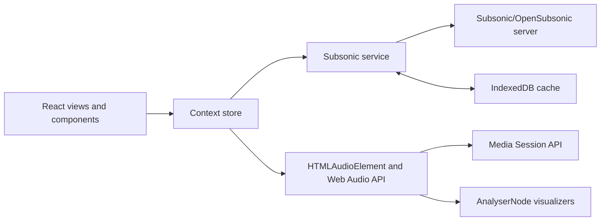

<div align="center">
  

  # Nebula Music

  **A polished, self-hosted web player for Subsonic and OpenSubsonic music libraries.**

  Stream from Navidrome, Gonic, Airsonic, and other compatible servers through
  a responsive interface built for desktop and mobile.

  [](https://github.com/lilremark/Nebula-Music)
  [](https://react.dev/)
  [](https://www.typescriptlang.org/)
  [](https://vite.dev/)
  [](./docker/README.md)
  [](./LICENSE.txt)

  [Features](#features) · [Screenshots](#screenshots) · [Quick Start](#quick-start) · [Docker](#docker) · [Contributing](#contributing)
</div>

---

## Screenshots

<p align="center">
  
</p>

<table>
  <tr>
    <td width="50%">
      
    </td>
    <td width="50%">
      
    </td>
  </tr>
  <tr>
    <td align="center"><strong>Now-playing sidebar and queue</strong></td>
    <td align="center"><strong>Full-screen player</strong></td>
  </tr>
</table>

## Features

### Playback

- Shared app-wide audio engine with queue, repeat, seek, volume, and Media Session controls
- Per-track playback speed and pitch controls with pitch-correction support
- Resilient Subsonic streaming with bounded URL caching and stalled-stream recovery
- Automatic transcoding rules for browser-sensitive formats such as ALAC and M4A
- Internet radio playback for direct streams and HLS playlists

### Listening Experience

- Web Audio visualizers including Bars, Wave, Circle, Mirror, Spectrum, Particles, Hexagon, Cube, and Grid
- Expandable full-screen player, desktop sidebar player, floating mini-player, and mobile player bar
- Structured and synchronized lyrics with fallback lyric providers
- AutoEq headphone calibration profile search and application
- Configurable keyboard shortcuts and an immersive Zen mode

### Library and Discovery

- Browse artists, albums, songs, playlists, favorites, and genres
- Spotlight-style search across artists, albums, and tracks
- Featured albums, random mixes, recent releases, and most-played statistics
- Persistent sorting and filtering by genre, year, and library metadata
- Demo mode for exploring the interface without connecting a server

### Platform

- Subsonic API 1.16.1 with fallback negotiation through API 1.14.0
- OpenSubsonic extension discovery and structured lyrics v2 support
- ID3-first album and starred endpoints with legacy server fallbacks
- Password token/salt authentication and optional OpenSubsonic API-key authentication
- Responsive light and dark themes with system-preference detection
- IndexedDB caching for API responses, settings, credentials, and local play statistics
- Docker, Vercel, and static-hosting deployment options

## Compatibility

Nebula Music supports servers implementing the Subsonic API or compatible
OpenSubsonic extensions, including:

- [Navidrome](https://www.navidrome.org/)
- [Gonic](https://github.com/sentriz/gonic)
- [Airsonic](https://airsonic.github.io/)
- Other Subsonic-compatible servers

The music server must be reachable from the browser running Nebula. HTTPS and
correct CORS configuration are strongly recommended.

## Quick Start

### Prerequisites

- [Node.js](https://nodejs.org/) 20.19+ or 22.12+; Node.js 24 LTS is recommended
- npm
- A reachable Subsonic-compatible server, unless using demo mode

### Local Development

```bash
git clone https://github.com/lilremark/Nebula-Music.git
cd Nebula-Music
npm install
npm run dev
```

Open [http://localhost:3000](http://localhost:3000). No environment variables
are required.

Choose one of the supported authentication methods:

- **Password:** Enter the server URL, username, and password. Nebula stores the
  generated token and salt instead of the raw password.
- **API key:** Enter the server URL and OpenSubsonic API key. Nebula omits the
  username and legacy token parameters as required by the extension.

### Production Build

```bash
npm run typecheck
npm run build
npm run preview
```

The production bundle is written to `dist/`.

## Docker

The included multi-stage image builds Nebula with Node.js 24 LTS and serves the
static bundle through an unprivileged NGINX 1.30.3 container. The Compose setup
uses a read-only filesystem, drops Linux capabilities, and includes a health
check.

```bash
docker compose -f docker/docker-compose.yml up -d --build
```

Open [http://localhost:8080](http://localhost:8080).

To stop the container:

```bash
docker compose -f docker/docker-compose.yml down
```

You can also build and run the image directly:

```bash
docker build -f docker/Dockerfile -t nebula-music:latest .
docker run --rm -p 8080:8080 nebula-music:latest
```

See [docker/README.md](./docker/README.md) for additional deployment details.

## Configuration and Storage

Nebula is a client-side application. Server details and preferences are entered
in the UI and stored in the browser.

| Storage | Contents |
| --- | --- |
| IndexedDB | Settings, cached API responses, authentication data, and per-server play statistics |
| `localStorage` | Lightweight play-history snapshots and the last-seen application version |

To reset the application completely, clear the site data for the Nebula origin
in your browser.

## Keyboard Shortcuts

| Action | Default |
| --- | --- |
| Play or pause | `Space` |
| Previous track | `ArrowLeft` |
| Next track | `ArrowRight` |
| Toggle repeat | `L` |
| Cycle visualizer | `V` |
| Toggle Zen mode | `Z` |

Shortcuts can be changed in Settings.

## Architecture

```text
Nebula-Music/
├── components/          Reusable UI, navigation, radio, and player components
├── constants/           Equalizer presets and shared constants
├── context/             Global store and theme state
├── docker/              Docker, Compose, and Nginx configuration
├── hooks/               Adaptive color, artist image, and waveform hooks
├── public/              Static browser assets and audio worklets
├── services/            Subsonic API, AutoEq, and IndexedDB services
├── screenshots/         README product screenshots
├── views/               Home, browse, library, radio, search, and settings views
├── App.tsx              Application shell and view routing
├── index.tsx            React bootstrap
└── index.css            Global styles and theme variables
```

### Data Flow



The global store coordinates library requests, cached responses, playback
state, and UI updates. A shared `HTMLAudioElement` handles playback while a
lazily created Web Audio graph powers analysis, visualizers, pitch processing,
and equalization.

## Scripts

| Command | Description |
| --- | --- |
| `npm run dev` | Start the Vite development server on port 3000 |
| `npm run typecheck` | Run TypeScript validation without emitting files |
| `npm run build` | Create the production bundle |
| `npm run preview` | Preview the production build locally |

## Deployment

### Vercel

1. Import this repository into Vercel.
2. Select the **Vite** framework preset.
3. Use `npm run build` as the build command.
4. Use `dist` as the output directory.

### Other Static Hosts

Build the project with `npm run build`, then deploy the generated `dist/`
directory to Netlify, Cloudflare Pages, Amazon S3, or another static host.

Because Nebula connects directly from the browser, the deployed origin must be
permitted by the music server's CORS policy.

## Troubleshooting

<details>
<summary><strong>Nebula cannot connect to my server</strong></summary>

- Verify that the URL includes `https://` or `http://`.
- Confirm the server is reachable from the same browser and network.
- Check the server's CORS configuration.
- Avoid mixed content: an HTTPS deployment cannot call an HTTP music server.
- Confirm the selected password or API-key authentication mode is supported by
  the server.

</details>

<details>
<summary><strong>Audio plays but seeking does not work</strong></summary>

- Confirm the server supports byte-range requests and returns appropriate
  `Content-Length` and `Accept-Ranges` headers.
- Enable server-side transcoding for formats the browser cannot seek reliably.

</details>

<details>
<summary><strong>Settings or themes do not persist</strong></summary>

- Ensure the browser is not blocking IndexedDB or local storage.
- Clear the site's stored data after changing between demo and live-server
  credentials.

</details>

## Changelog

### v2.1.3 — June 20, 2026

- Updated all npm dependencies, including React 19, Vite 8, Tailwind CSS 4,
  TypeScript 6, Motion 12, and Lucide React 1.
- Added OpenSubsonic extension discovery and API-key authentication.
- Added structured lyrics v2 and ID3-first album/starred endpoints with legacy
  fallbacks.
- Added Subsonic protocol fallback negotiation from API 1.16.1 through 1.14.0.
- Centralized Subsonic response and error handling.
- Updated Docker builds to Node.js 24 LTS and unprivileged NGINX 1.30, with a
  read-only runtime, dropped capabilities, and container health checks.
- Added refreshed product screenshots and updated project documentation.

### v2.1.2 — May 10, 2026

- Added AutoEq headphone calibration.
- Added production Docker and Nginx deployment files.
- Improved long-session Subsonic playback recovery.
- Refined visualizer controls and Settings layout.

See the [commit history](https://github.com/lilremark/Nebula-Music/commits/main/)
for the complete development history.

## Contributing

Issues and pull requests are welcome. Read [CONTRIBUTING.md](./CONTRIBUTING.md)
for development requirements, validation commands, and pull-request guidance.

Security vulnerabilities must not be reported publicly. Email
**remark@remark.rip** and follow [SECURITY.md](./SECURITY.md).

## License

Distributed under the [MIT License](./LICENSE.txt).
